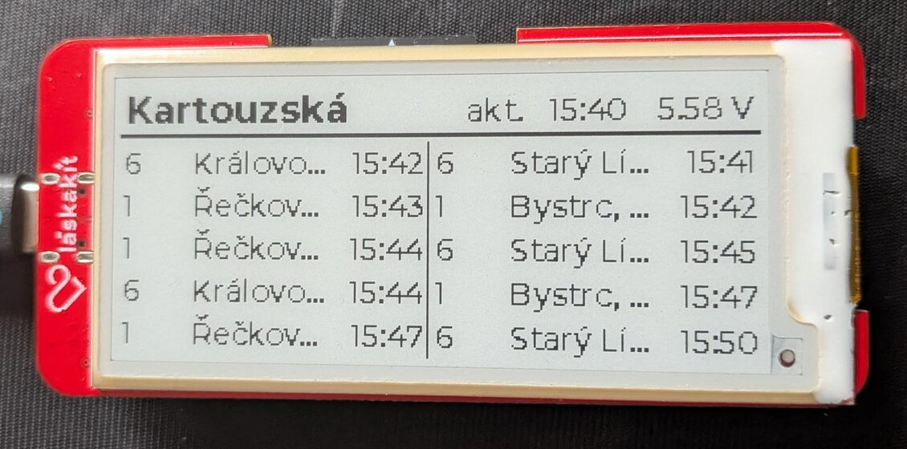
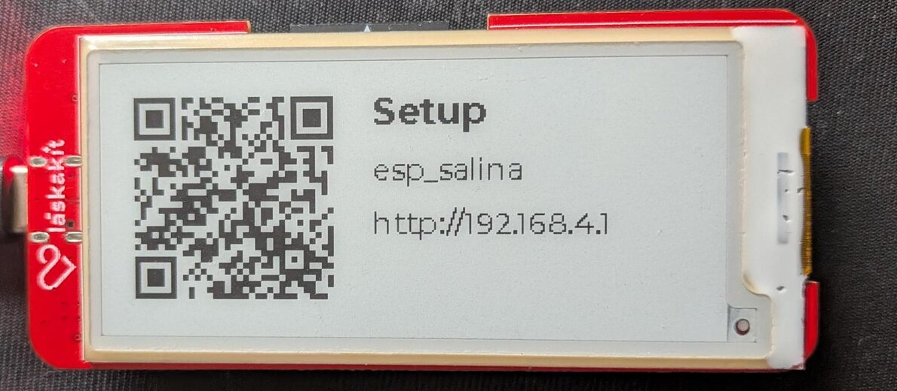

# esp_salina

A public transport departure board for any stop in the Brno IDS JMK area, on a
[LaskaKit ESPink-Shelf-2.9](https://www.laskakit.cz/laskakit-espink-shelf-2-9-esp32-e-paper/)
(ESP32 + a 2.9" GDEY029T94 e-paper panel).

It wakes on a timer, joins Wi-Fi, fetches the next departures from the IDS JMK
API, draws two platforms side by side, refreshes the panel and goes back to deep
sleep.



The panel is driven by [`dzarda7/esp_epaper`](https://components.espressif.com/components/dzarda7/esp_epaper),
a separate component that is not tied to this display. Moving to another
e-paper panel is mostly a matter of pointing `BOARD_EPD_PANEL` at a different
descriptor - see [Porting](#porting).

## Building

Needs ESP-IDF v6.0 or newer; developed against v6.2.

```sh
idf.py set-target esp32
idf.py menuconfig      # intervals, battery, optional config pin
idf.py flash monitor
```

## Setup

Wi-Fi and the stop are not compiled in. A board with nothing stored raises its
own access point and shows how to reach it, so the binary carries no
credentials and moving to another network needs no rebuild.

1. Flash and power up. The screen shows a QR code and the network name.

   

2. Scan the QR, or join the open `esp_salina` network by hand. The setup page
   should open by itself; if it does not, go to `http://192.168.4.1`.
3. Pick your network and enter its password. The board joins while keeping the
   setup network alive, so the page stays reachable - it may blink out for a
   second as the radio changes channel.
4. Type the stop name. Case and diacritics do not matter, `kartouzska` finds
   `Kartouzská`, and partial names work. Any IDS JMK stop will do, not just
   Brno ones - `znojmo`, `blansko` and `kurim` all resolve. The result names
   the town, so check it before saving. Pick a platform for each column from
   the ones it found, and save. The board restarts and starts showing
   departures.

The portal stays up until you finish it, so an unprovisioned board keeps its
radio on. Power it from USB while setting it up rather than leaving it on a
battery.

The settings live in NVS. To change them, either erase NVS over the cable or
set `SALINA_CONFIG_PIN` to a GPIO and hold a button on it at boot. Not GPIO0 -
low at reset puts the ESP32 into ROM download mode.

Platforms only exist in the API while they have upcoming departures, so setting
up in the middle of the night can show a stop with no platforms to choose.

## Configuration

The rest is in `idf.py menuconfig` under *Salina departure display*: the update
interval, retry attempts, the night window and the battery divider.

## Design notes

**Departure times are absolute, not countdowns.** The API answers either
`16:03` or `7min`; the countdown is only true at the instant of the request and
is stale by the time the panel next refreshes, so it is converted to the wall
clock time of the departure. Without a synced clock it falls back to the
countdown rather than printing a time it cannot justify.

**A failed update leaves the screen alone.** E-paper holds its image without
power, so a Wi-Fi or API failure keeps the last good departures on the glass
rather than painting an error page. The API sometimes answers with the stop but
no platforms, so the fetch retries a few times while Wi-Fi is still up; only
after those does the wake give up and wait for the next one. The `upd.` stamp
therefore always tells you when the data on screen was actually fetched.

## Layout

The layout is derived from whatever size the driver reports: column width from
the panel width, row count from `(height - header) / row height`. A taller panel
simply shows more departures. Fonts are fixed sizes, generated as 1bpp subsets.

Within a column: line number, a gutter, the destination (ellipsised when it does
not fit), and the departure time. The time and line number are never shortened -
a time cut to `16:0…` is worse than no time at all - so they get columns wide
enough for their longest value, measured from the font.

## Porting

| To change | Edit |
|---|---|
| Board pins, panel model, orientation | `main/board.h` |
| Data source (another city, a proxy) | `main/idsjmk.c`, filling `salina_data_t` from `main/salina.h` |
| Screen layout | `main/ui.c` |
| Sleep and retry policy | `main/main.c` |

The display driver is a separate component,
[`dzarda7/esp_epaper`](https://components.espressif.com/components/dzarda7/esp_epaper),
pulled from the registry by the component manager. It is not specific to this
panel.

Swapping in a panel the component does not ship does not need a fork either -
`epd_panel_desc_t` is public, so a descriptor can live in `main/` beside
`board.h` and `BOARD_EPD_PANEL` can point at it.

## Fonts

`main/fonts/` holds 1bpp Montserrat subsets (ASCII, Czech diacritics, and a few
FontAwesome glyphs), generated with `lv_font_conv`:

```sh
npx lv_font_conv --bpp 1 --size 14 \
  --font Montserrat-Medium.ttf -r '0x20-0x7F' \
  --symbols "ÁáČčĎďÉéĚěÍíŇňÓóŘřŠšŤťÚúŮůÝýŽž" \
  --font FontAwesome5-Solid+Brands+Regular.woff -r "61931,62016,62017,62018,62019,62020" \
  --format lvgl -o main/fonts/font_salina_14.c --force-fast-kern-format --lv-include lvgl.h
```

1bpp rather than anti-aliased: on a monochrome panel the grey levels would only
be dithered away.
